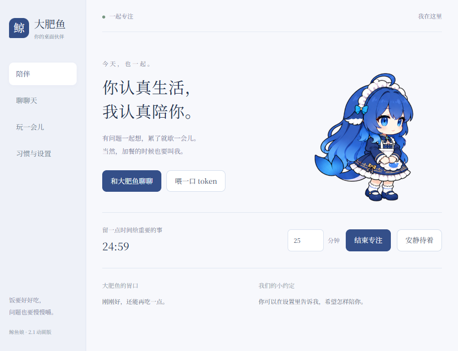
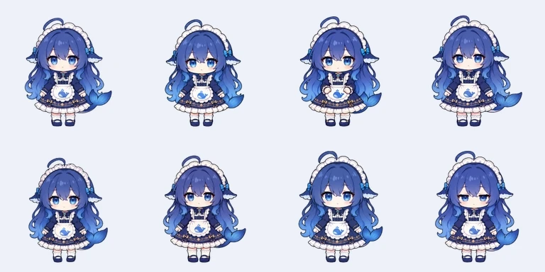
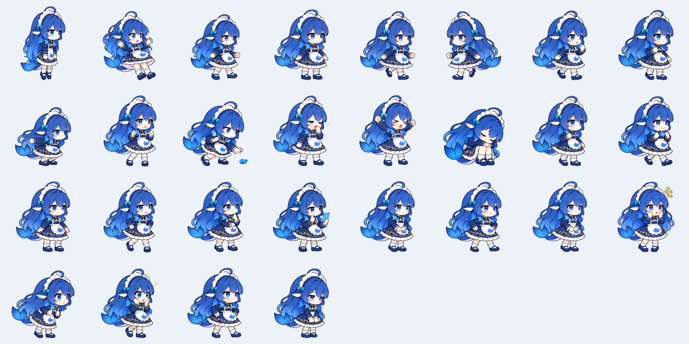
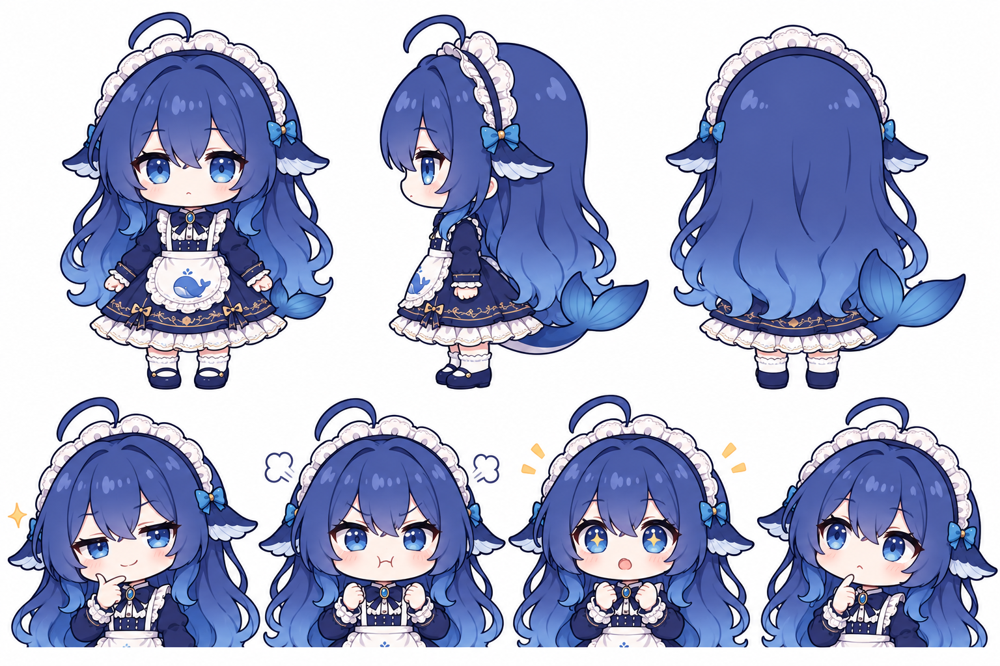

<div align="center">

# 大肥鱼 🐋

**饭要好好吃，问题也要慢慢嚼。**

一只聪明、嘴硬、贪吃的蓝色鲸鱼娘，陪你工作、聊天，也陪你摸一会儿鱼。

Windows 桌宠 · 60 FPS 渲染 · 窗口边缘互动 · 自定义 AI 聊天

[认识她](#她叫大肥鱼) · [看看效果](#她会做什么) · [带她回家](#带她回家) · [角色设定](docs/角色设定.md)



</div>

## 她叫大肥鱼

“我不是大肥鱼……”

嘴上小声抗议，眼睛已经在看你手里的零食了。

她爱吃饭，也把 token 当作脑力口粮。遇到难题会认真想，被夸会偷偷得意；你忙的时候，她也知道安静待着。贪吃是她的性格，饭碗不是她的固定装备。

项目灵感来自社区图片「你这吃白饭的蓝色大肥鱼」。这是一次围绕 DeepSeek 鲸鱼娘的社区二创，不是 DeepSeek 官方产品。

<details>
<summary>最初的灵感，从这张图开始</summary>


</details>

## 她会做什么

**在桌面上陪你。** 拖起来会晃一晃，松手后落下、压扁，再弹回来。她能站在可见窗口的顶边，跟着窗口移动；窗口关掉或最小化后，就落回桌面。

**有自己的小动作。** 眨眼、走路、挥手、跳舞、偷吃 token、打哈欠、蜷起来睡觉，还有鼓腮、害羞、思考和小得意。整套素材由 112 个高清原帧组成。



<details>
<summary>再看一眼她的表情和落地回弹</summary>




</details>

**聊聊天，一起专注。** 接入 DeepSeek 或兼容 OpenAI 格式的本地服务，就能和她聊天。也可以不联网，摸摸、喂食、开一个专注计时，或者玩一局接口粮小游戏。

**按你的习惯相处。** 待机少一点表演、眨眼多一点自然间隔，随机小动作也会留出安静时间。 大小支持 0–100% 调整，能安静陪伴、暂时隐藏或开启鼠标穿透。你可以写下相处约定；画面分享由你选择是否开启。

**也能去 Codex 串门。** 在设置中导出外观宠物包，或者使用仓库里的 [Codex 素材包](codex-deepseek-pet)。导出的只是外观，聊天和桌面互动属于独立程序。

## 她的样子

圆脸、大眼睛、蓝色长发、鲸尾，还有一身深蓝白色的小裙子。我们希望她看起来软乎乎，性格却不是只会点头。



想了解她的性格、说话方式和造型约定，可以看 [完整角色设定](docs/角色设定.md)。设计图是造型参考，实际运行效果以上面的截图和动画为准。

## 带她回家

当前分支是 **2.1 桌面陪伴版**，适用于 Windows x64。

[Releases](https://github.com/YunYueSama/codex-deepseek-pet/releases) 中的历史安装包可能尚未包含本页展示的新功能。体验当前分支，可以在安装 Node.js 20+ 后运行：

```bash
git clone https://github.com/YunYueSama/codex-deepseek-pet.git
cd codex-deepseek-pet
npm ci
npm start
```

想生成自己的免安装 EXE 或安装包，执行 `npm run dist`，文件会出现在 `artifacts/`。已经拿到免安装版的朋友，直接双击运行即可，不需要 Node.js。

### 几个小动作

| 你来做 | 她会回应 |
| --- | --- |
| 单击 / 空格 | 摸摸 |
| 双击 / 回车 | 打开陪伴面板 |
| 按住拖动 | 拎起来，松手落下 |
| F | 喂一口 token |
| 右键 / 托盘图标 | 打开控制菜单 |
| Ctrl + Alt + P | 切换鼠标穿透 |

大小调到 0% 会隐藏角色；点击托盘图标，打开设置就能调回来。

### 想和她聊聊天

在「习惯与设置」填入服务地址、模型名称和自己的密钥。例如 DeepSeek 地址可用 `https://api.deepseek.com/v1`；本地服务可用 `http://127.0.0.1:1234/v1`，模型名称按你的服务填写。

密钥不需要发给任何人。聊天使用你所配置服务的额度；喂食和小游戏中的 token 是虚构口粮，不会消耗模型额度。

## 关于陪伴，也关于分寸

- 基础桌宠互动可以离线使用。聊天会发送对话和保存的相处约定；聊天历史退出后清空，设置保存在本机，密钥由系统加密保存。
- 画面分享默认关闭。手动分享先预览，再发送；自动观察需单独开启，并可能产生接口费用。看图还需要支持图片的模型。
- 应用感知在本机判断前台程序类别，不代表她自动读懂了网页。她会回应，不会擅自执行电脑操作。

## 还在慢慢长大

当前以 60 FPS 为渲染目标，本机全动作短时测试约为 60 FPS。她仍是序列帧动画，部分表情采用关键姿势切换，并不是每秒 60 张不同原画，也还没有完整骨骼动画。

更自然的动作衔接、更轻的内存占用、流式聊天与语音，以及更多屏幕环境下的稳定表现，都是值得继续打磨的方向。Codex 外观包在不同宿主版本中的表现也欢迎反馈。

如果她在你的电脑上出现穿窗、抖动、动作不自然，欢迎带上系统缩放比例、操作步骤和截图到 [Issues](https://github.com/YunYueSama/codex-deepseek-pet/issues) 告诉我们。也欢迎分享你想看到的动作、台词和互动点子。

想一起动手：[开发指南](docs/开发指南.md) · [动画与窗口互动](docs/动画与窗口物理.md) · [素材制作说明](design/生成说明.md)

---

代码使用 [MIT License](LICENSE)。角色与参考图片不随代码授予额外使用权，详见 [素材说明](ASSET_LICENSE.md)；本地字体使用 SIL Open Font License。感谢社区创作者带来的灵感。若你是参考图片的权利人，希望补充署名或调整使用方式，欢迎联系维护者。
